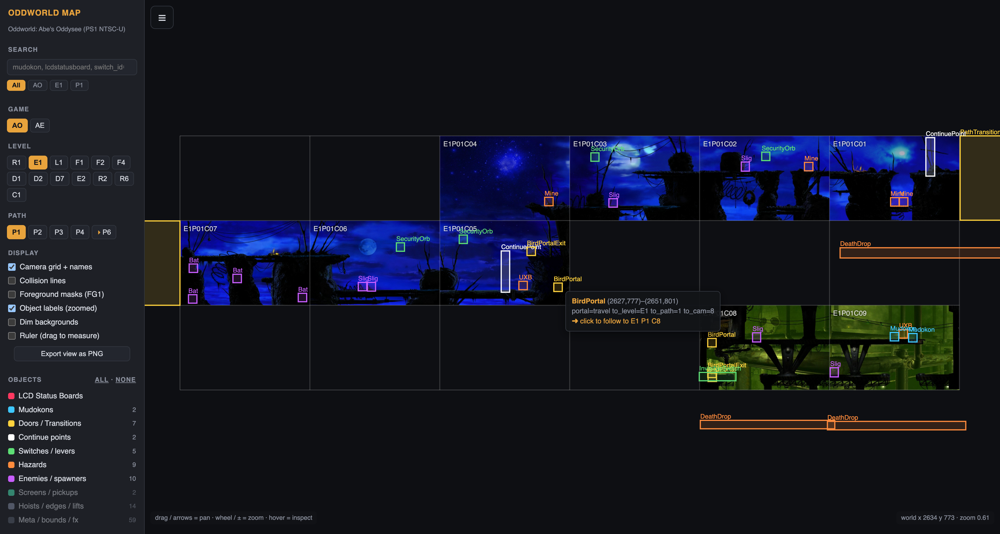

# Oddworld Map

Interactive map of **Oddworld: Abe's Oddysee** and **Abe's Exoddus** (PS1, NTSC-U), extracted directly from the game discs: every camera background, every object (doors, levers, Mudokons, LCD status boards, hazards, enemies, ...) and every collision line, laid out on the games' real camera grids. The data comes from the PS1 discs, but level layouts, screens and object placements are the same in the PC releases, so the map applies to every version of the games.

Browse it at **[oddworldmap.com](https://oddworldmap.com/)** — or serve the repo root with any static web server (`python3 -m http.server`) to run it locally.



## Controls

- **AO / AE** buttons switch between the two games
- **drag** or **arrow keys** to pan, **mouse wheel** (anchored at the cursor) or **`+` / `-`** to zoom; **`[` / `]`** step through the level's paths, **`g` / `c` / `f` / `a`** flip the grid, collision lines, foreground masks and connection arrows, and **`r`** / **`m`** arm the route planner and the ruler — press **`?`** for the full shortcut list
- **hover** any object for decoded details — door destinations (level/path/door#), switch IDs, path-transition targets, continue-point zones, Mudokon state (Oddysee job / Exoddus work state + mood), and enemy behaviour (a Slig's start state and how it attacks — `shoot_on_sight_delay=0` means it shoots the instant it sees Abe, no "FREEZE!" warning; whether a Slog starts asleep and the switch that angers it). Turn on "Show more object fields" in Settings to pick which of the game's stored fields each object type shows (search always covers them all)
- **click** a door, path transition, travel portal, express well, teleporter or hand stone to follow it to its destination (for hand stones, the camera they show), including across levels; while hovering one, its partner — the object you'd come out of — gets a dashed outline whenever the pair sits on the current path. The rare transition pointing at a level outside the map (Oddysee's main-menu level) says so in its tooltip instead of offering a follow
- **click/tap** anywhere else on a screen to list everything on it, grouped by category — hover a row to outline that object on the map, click it to jump there. Tapping an object opens the list scrolled to that object's highlighted row: on touch devices, where there is no hover, this is how you inspect an object. On phones the panel opens as a bottom sheet with the map staying visible above it; switch "List a screen's objects on click" off in Settings if you'd rather those clicks did nothing
- level and path buttons top-left; object category filters with counts below — hover a path button for its area name: a curated community name from [annotations.json](annotations.json) where one is defined (a deliberate override), otherwise the in-game name (Rupture Farms Return's Zulag 1–4, Exoddus ender areas)
- **reset** in the Display and Objects headers puts that section back to its defaults
- **Collision lines**: floors green, walls red/orange, ceilings blue, dashed = background layer
- **Foreground masks (FG1)**: highlights the scenery drawn in front of the player — every hideable/behind-walkable spot at a glance (pairs well with "Dim backgrounds")
- **Connection arrows**: draws the path's whole circulation — every door, express well, bird portal, teleporter and path transition linked to where it leads. A double-headed arrow is a two-way pair; a dashed arrow points at the arrival camera when the exact arrival object isn't resolvable; short 45° stubs labelled `→ MI P7` lead to other paths (stub labels appear zoomed in with object labels on). Colours tell the kinds apart: doors yellow, wells pink, bird portals lavender, teleporters teal, path transitions white. Hovering an object spotlights just its own arrows
- the URL hash (`#LEVEL/path/x/y/zoom`) always reflects the current view, including any plotted route — copy it to share an exact location; the browser back button retraces follows. The chain button in the top-right corner copies the same link, for phones and installed-app mode where there may be no address bar
- add **`?embed=1`** to the URL for a view made for iframes on wikis and forums: the map fills the frame, fully interactive (hover, follow, the screen-list panel), with the sidebar starting closed but reachable through the menu button; a corner button opens the full site at the exact view. Combine it with any permalink hash to embed an exact screen, e.g. `https://oddworldmap.com/?embed=1#AO/R1/15/…`
- **right-click** an object to copy a direct link to it — opening that link centers the object and holds a marker on it until you've had a chance to look and interact
- **search** (`/` to focus) matches object names and decoded fields across both games — try `mudokon`, `lcdstatusboard` or `switch_id=70`. Results are grouped by context (current path, current level, then per game), rank exact name matches first, and clicking (or Enter) jumps straight to the hit; a scope bar narrows the search to the current game/level/path
- **Ruler**: enable (or press **`m`**), then drag to measure — Δx × Δy, length in true world units and 25-unit grid squares (an Oddysee unit is one PS1 screen pixel; Exoddus artwork slightly squeezes its 375×260-unit screens, and measurements account for that); hovering a collision line shows its type and length the same way
- **Route planner**: arm it (or press **`r`**), then click waypoints to plot a route — every leg is labelled with its length, and a bar at the top totals the distance in the same units. **Backspace** (or the bar's undo button) removes the last waypoint; clear starts over, and the browser back button brings a cleared route back. The route travels in the URL, so copying the link shares it exactly as plotted — it opens visible with the map fully browsable, no mode armed — and it appears in PNG exports; switching paths clears it
- on touch devices one finger pans and two fingers pinch-zoom; the sidebar collapses behind a menu button on narrow screens
- **What's new**: the top-right button opens a dated changelog of recent updates; a dot marks entries added since you last opened it
- **Settings**: the gear button at the top of the sidebar — by default the Display toggles and Objects filters are remembered across visits; turn off "Remember display & object filters" to start from the defaults every time. "Remember last location" (off by default) reopens the map where you left off when the URL carries no permalink — a shared link always wins. "Show full names" expands the game, level and path buttons into a list labelled with their full names ("MI (Necrum Mines)"). "List a screen's objects on click" (on by default) opens the screen-inventory panel when a click/tap finds nothing to follow. "Show more object fields" (off by default) reveals a "Fields" panel in the sidebar where you pick, per object type, which of its fields show in tooltips and the screen list (the notable ones pre-checked) — a ⚙ next to an object in a screen's list opens that type's row in the panel; with it off, only the notable fields show and the panel stays hidden. "Show raw field values" (off by default) shows field values as the raw numbers the game stores (1/0, 15, …) instead of the translated text (left/right, patrol, true/false) — for custom-level builders and dev-minded readers; search still matches the translated text. "Cache screen artwork on this device" (off by default) keeps visited screens stored locally — up to ~150 MB — so the next visit doesn't re-download them; switching it off frees the storage

One grid cell = one in-game camera. Each camera occupies a 1024×480-unit cell in the game's world grid, but the visible screen is a 368×240-unit window centered at (cell·1024+440, cell·480+240) — world units map 1:1 to PS1 screen pixels. The viewer lays the visible windows out edge to edge and translates all object/collision coordinates accordingly, so markers land on the artwork.

## Rebuilding from a disc image

Everything under the repo root (`cams/`, `map_data_ao.json`, `map_data_ae.json`) is generated by [tools/build_map.py](tools/build_map.py) from raw PS1 disc images (2352-byte sectors, e.g. the `.bin` of a `.cue/.bin` dump):

```bash
python3 tools/build_map.py --game AO --disc "/path/to/Abe's Oddysee.bin"
python3 tools/build_map.py --game AE --disc "/path/to/Exoddus (Disc 1).bin" "/path/to/Exoddus (Disc 2).bin"
python3 tools/build_map.py --levels R2,R6   # subset while iterating
```

`--disc` can be omitted if `$ODDWORLD_DISC_AO` / `$ODDWORLD_DISC_AE` point at the images; `$ODDWORLD_DISC_AE` holds both discs separated by `:` (the PATH separator):

```bash
export ODDWORLD_DISC_AO="$HOME/games/Abe's Oddysee.bin"
export ODDWORLD_DISC_AE="$HOME/games/Exoddus (Disc 1).bin:$HOME/games/Exoddus (Disc 2).bin"
```

The script compiles `tools/cam2rgba` automatically on first run (needs a C++17 compiler) and requires [oxipng](https://github.com/oxipng/oxipng) — every emitted PNG is losslessly recompressed so rebuilds stay byte-identical to the committed images. Level/path table layouts are cached in [tools/data/pathdata_ao.json](tools/data/pathdata_ao.json); they only need regenerating (which requires an [alive_reversing](https://github.com/AliveTeam/alive_reversing) checkout as a sibling directory) if that cache is deleted.

If a rebuild changes any committed cam PNG, bump `CACHE_NAME` in [sw.js](sw.js) in the same commit: visitors who opted into artwork caching serve cams cache-first from a service worker and never revalidate them, so without the bump they keep the old images indefinitely.

## How it works

- **Disc → files**: raw MODE2/FORM1 sectors are parsed as ISO9660; each level is a `.LVL` archive (32-byte header + 24-byte file records) containing the path data (`xxPATH.BND`) and one `.CAM` per camera.
- **Path chunks** hold, in order: the camera-name table (8 bytes/cell), collision lines (20 bytes, coordinates + type), and packed TLV object records (0x18-byte header in AO, 0x10 in AE, + type-specific payload) which the builder walks linearly and places by world coordinates. Level/path tables and the AE type enum are parsed from the [alive_reversing](https://github.com/AliveTeam/alive_reversing) decompilation into `tools/data/` caches.
- **Camera backgrounds** are MDEC-compressed: 12 strips per screen, each a `u16 length` + standard PS1 BS v3 bitstream decoding to 32×240, assembled into 384×240 and written as PNG (368 visible columns + 16 columns of macroblock padding, cropped by the viewer). The decoder (`tools/cam2rgba.cpp`) is built on `PSXMDECDecoder` from the [alive_reversing](https://github.com/AliveTeam/alive_reversing) project, patched for bounds-safe decoding of camera strip streams.
- The viewer is dependency-free vanilla JS with no build step: [index.html](index.html) plus [css/main.css](css/main.css) and the ES modules under [js/](js/) ([js/main.js](js/main.js) boots the app); `map_data_ao.json` / `map_data_ae.json` carry the level/path/TLV/collision data. An optional service worker ([sw.js](sw.js), off by default — Settings → "Cache screen artwork on this device") keeps visited screen artwork cached on-device, so repeat visits render instantly instead of re-downloading it. `npm run lint` (ESLint) and `npm test` (`node --test` unit tests for the DOM-free logic) are the only dev tooling; CI runs both. [annotations.json](annotations.json) is hand-curated (never generated): names and notes the discs don't provide — community names for the ~160 paths the games leave nameless, and notes for levels the map doesn't render (AO's `S1` main-menu level). A curated name deliberately overrides the in-game one where both exist, but must keep the in-game label visible within it ("Zulag 2 — Lobby", never a full erasure — the tests enforce this); the extracted map data itself is never altered. The in-app What's New panel reads [changelog.json](changelog.json) (hand-curated, newest-first); [tools/changelog.py](tools/changelog.py) drafts candidate entries from the git log (dropping internal churn and printing each commit as context) to be curated in, but never writes the file itself.

Structure layouts (TLV types, path tables, collision records) come from the alive_reversing decompilation (commit `c1ba4c6c8` for AO, current sources for AE), which matches the PS1 data formats. AO cameras occupy 1024×480-unit world cells showing a 368×240 window (1:1 world:pixel); AE cameras are 375×260-unit cells displayed scaled.

## Credits & licensing

- Game data formats reverse-engineered by the [AliveTeam / alive_reversing](https://github.com/AliveTeam/alive_reversing) project.
- Curated path names in [annotations.json](annotations.json) draw on Oddworld: New 'n' Tasty's official chapter names and on the [Barebones walkthrough](https://steamcommunity.com/sharedfiles/filedetails/?id=1812678216) on Steam, whose per-path titles most of the Oddysee names follow; a curated name may refine the games' own coarse labels, but the extracted data is never altered.
- `tools/PSXMDECDecoder.{cpp,h}` are GPL-2.0 (see file headers; originally from libbs / psxdev). The rest of the tooling and the viewer were written for this project.
- Oddworld: Abe's Oddysee and Abe's Exoddus are © Oddworld Inhabitants. This project ships no game code and is intended for research, speedrunning and preservation; the extracted imagery remains the property of its copyright holders.
